## Nombre del videojuego: La Maldición del Peluche Infernal

## Memoria
El primer día, se nos presentó el proyecto y descargamos el repositorio de la plantilla
para probarla y ver donde se ubicaban las cosas dentro de este proyecto. Ese día nos
centramos en conocer al grupo y destacar que cosas eran necesarias de arreglar de la 
plantilla.

El segundo día nos reunimos en el laboratorio y hicimos una lluvia de ideas de como iba
a ser el juego, entre todos decidimos que este juego sería un juego basado en el humor
con un estilo similar a "the legend of zelda" pero con las mecánicas de combate por turnos.

Con el diseño ya en mente el jefe de proyecto distribuiría las tareas a realizar via 
GitHub, de forma que la siguiente vez que nos reunimos en el laboratorio fuimos con las 
ideas claras y trabajamos cada uno en su lista de tareas, ese mismo día después de la 
clase de teoría la mayoría del grupo termino o dejo casi terminadas sus tareas.

La semana previa al examen para centrarnos en estudiar acordamos que puliríamos lo que ya
teníamos para no sobrecargarnos de trabajo, una vez que el examen se realizó el jefe de
proyecto envió nuevas tareas esta vez por medio de WhatsApp, al ser más complejas llevaron
más tiempo y problemas (como la interacción del jugador con los npcs), pero fueron acabadas 
para la fecha de entrega.

## Manual de usuario
Inicia la aventura La Maldición del Peluche Infernal, al entrar al juego verás una interfaz
de usuario de un menu con las siguientes opciones:
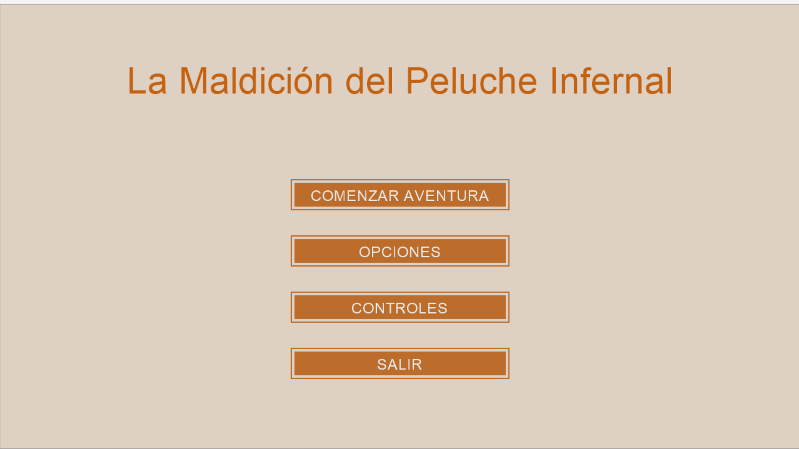
Los controles son:
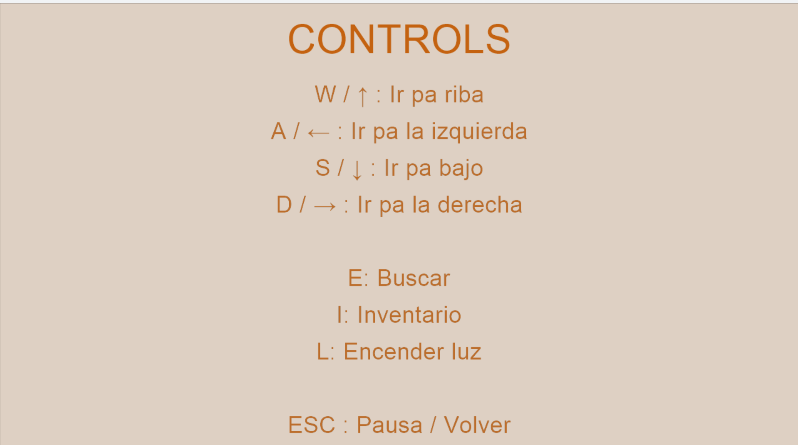
Las opcienes de ajuste son:
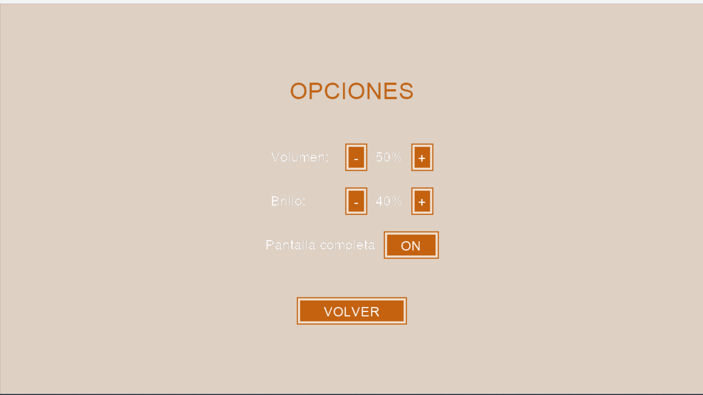
Al iniciar la aventura aparecerás en el jardín.
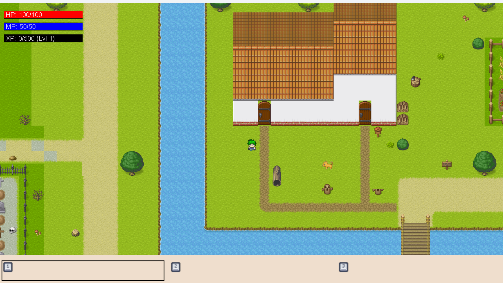
Arriba podrás encontrar tu casa.
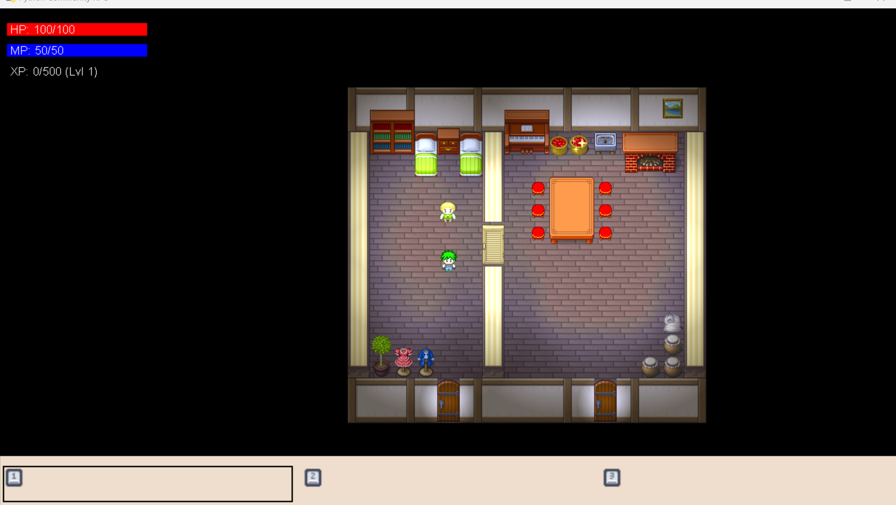
Al sur encotrarás la herrería.
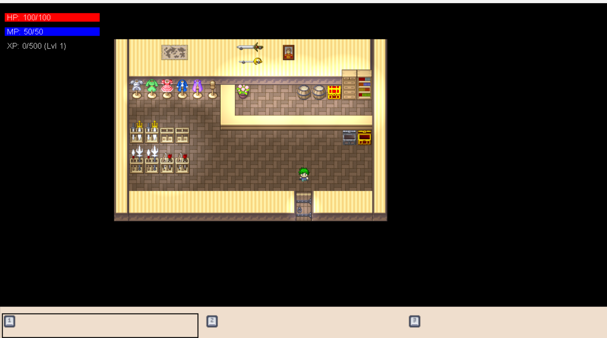
Y al este el cementerio.
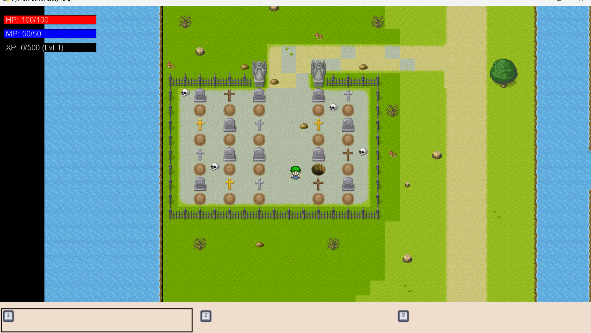
En el cementerio encontrarás enemigos con los que combatir.
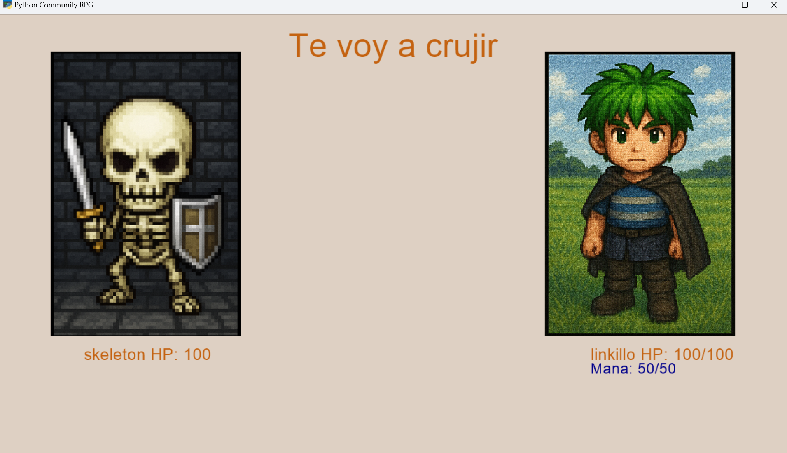
Y objetos para curarte.
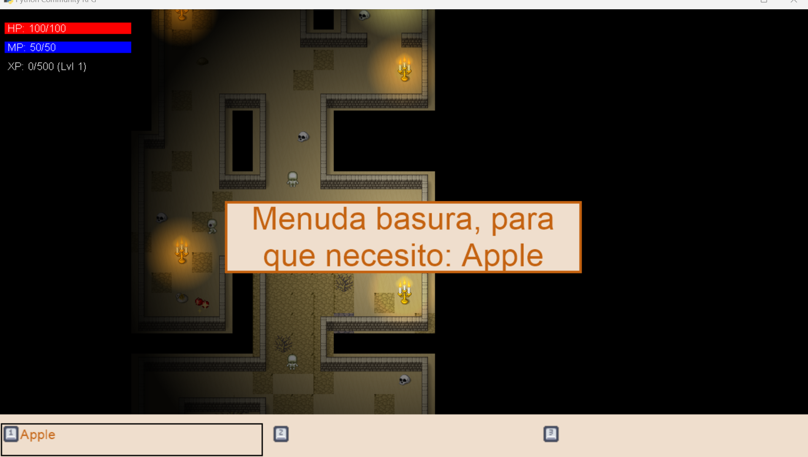
En el cementerio investigarás una mazmorra para rescatar el osito de peluche de tu hermano.
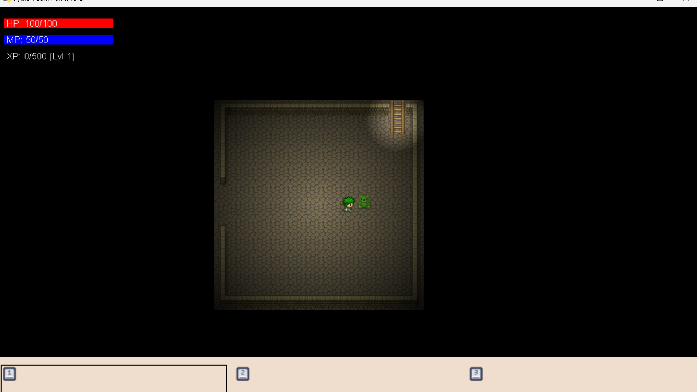
Con diferentes niveles y un laberinto.
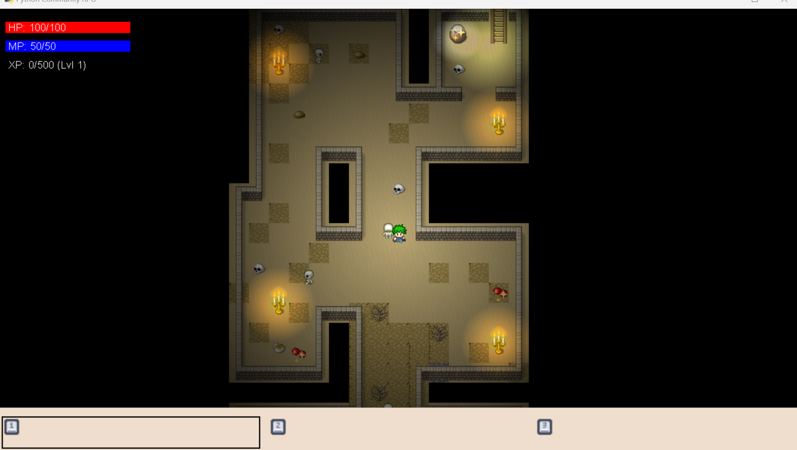
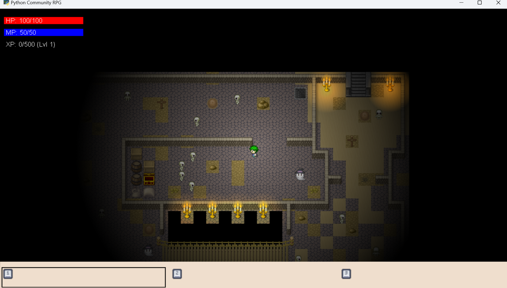
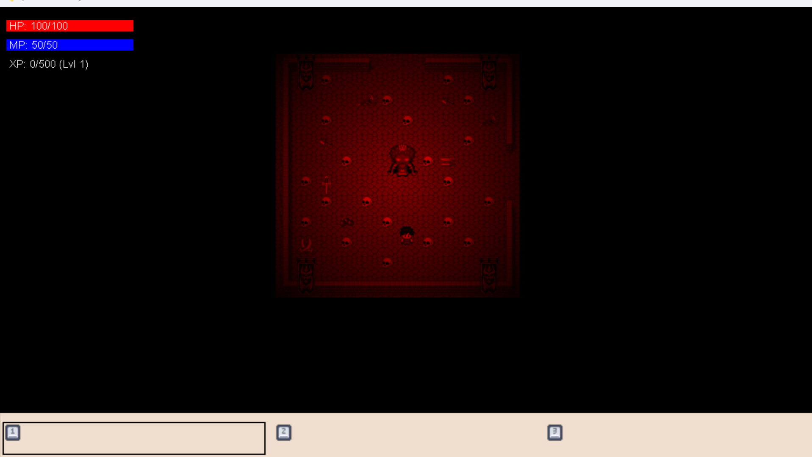

## Tareas completadas
 ### Diseño
 - Crear historia general y narrativa del juego.

 - Diseñar al protagonista: Linkillo.

 - Diseñar al antagonista: Rey Demonio Patatón.

 - Diseñar a los 4 minibosses con sus estilos de combate únicos.

 - Diseñar al NPC Don Yunque. (Si está hecho, pero no está implementado)

 - Diseñar al NPC Mochito.

 - Diseñar los objeto interactuables del mapa.

 - Diseñar las mecánicas del juego (combate, inventario, diálogo, objetos).

 - Definir las físicas (colisiones, desbloqueo de puertas, etc.).

 - Definir la secuencia de niveles (del nivel 1 al 7).

### Lógica del juego
 - Implementar la mecánica de combate.

 - Implementar la mecánica de inventario.

 - Implementar la mecánica de diálogo.

 - Implementar la progresión por niveles.

 - Implementar el sistema de objetos y mejora de estadísticas.

 - Implementar efectos de sonido al recoger objetos.

 - Implementar sistema de desbloqueo de puertas.

### Arte y Sonido

 - Localizar o crear hojas de sprites (personajes, enemigos, objetos).

 - Crear arte del menú de inicio.

 - Crear arte para cada vista del juego (batalla, inventario, ayuda, etc.).

 - Localizar o crear efectos de sonido.

 - Localizar o crear música ambiental.

 - Diseñar estética general estilo "medieval Zelda cómico".

### Control de calidad
 - Definir plan de pruebas (por niveles, mecánicas, estabilidad).

 - Ejecutar pruebas funcionales y de jugabilidad.

 - Comprobar el repositorio antes de entrega (nombres, estructura, coherencia).

### Documentación
 - Redactar documento de diseño (este mismo documento).

 - Redactar memoria del proyecto (estructura técnica + desarrollo).

 - Redactar instrucciones de uso del juego para el usuario final.

### Interfaz de usuario
 - Implementar menú de inicio.

 - Implementar vista de arranque.

 - Implementar vista de batalla.

 - Implementar vista de inventario.

 - Implementar vista de configuración.

 - Implementar vista de diálogo/NPCs.

 - Implementar transiciones entre niveles.
### Integración de niveles
 - Crear nivel 1 (casa pacífica).

 - Crear nivel 2 (jardín exterior).

 - Crear nivel 3 (herrería).

 - Crear nivel 4 y 5 (cementerio).

 - Crear niveles 6-7 (laberinto y sala del boss final).

 - Integrar todos los niveles en la lógica del juego.

### Audio y ambientación
 - Agregar música ambiental.

### Mecánicas
 - Tenemos una pantalla inicial que ofrece a los jugadores un sitio para ver los controles
   Ajustar el volumen y brillo, salir del juego y obviamente iniciar aventura.

 - Dentro de la propia partida hay un menu pulsando escape para salir del juego, ajustar el
   brillo y el volumen, ver los controles y reiniciar.

 - Hay una opción en los dos menus del jugador para ajustar el volumen y el brillo de la 
   pantalla.

 - El jugador puede acceder a un inventario donde tiene guardado diferentes objetos con
   diferentes funciones como por ejemplo curar al jugado.

 - Hay diferentes objetos repartidos por el mapa, que desempeñan funciones utiles para la 
   aventura como por ejemplo curar al jugador.

 - Hay una mecánica de combate en la que puedes luchar contra diferentes enemigos, en la 
   pantalla de batalla puedes seleccionar la opción de utilizar magia, atacar, usar objetos
   y huir, es un combate por turnos contra diferentes oponentes.

 - El jugador posee tres barras con las estadísticas de vida, mana y experiencia.

 - El jugador puede utilizar mana para hacer magia y hacer más daños, el mana se
   restaurará con el tiempo mientras no estes combatiendo.

 - Al terminar el combate el usuario recibirá experiencia con la que podrá subir de nivel
   y aumentar sus estadísticas 

 - El usuario puede interactuar con personajes, objetos y enemigos a través de cuadros de 
   diálogo

### Tareas no completadas
 - No se ha podido realizar colisiones con los enemigos

 - La música si bien se ha conseguido implementar no hemos conseguido hacer que sea 
   una por zona y adaptada a la situación

 - No hemos conseguido implementar al herrero que funcionaría como un nivel de tutorial

 - No hemos logrado el bloqueo de puertas 

### Dificultades
 - Con diferencia lo que más nos ha costado han sido las interacciones con los objetos y
   los enemigos, con estos últimos pensábamos que los habíamos logrado poner a la primera con 
   una ruta de movimiento y que funcionarían según lo esperado, pero al ser polígonos no 
   interactuaban según lo esperado, eso nos ha frenado mucho al no poder interactuar con los
   enemigos para poder seguir con la mecánica y seguir con el resto de cosas.

 - La battle view nos ha costado más de lo esperado el pasarle los datos de los jugadores y
   los enemigos y que al acabar la batalla modifique las barras de vida, mana, y experiencia
   del jugador.

